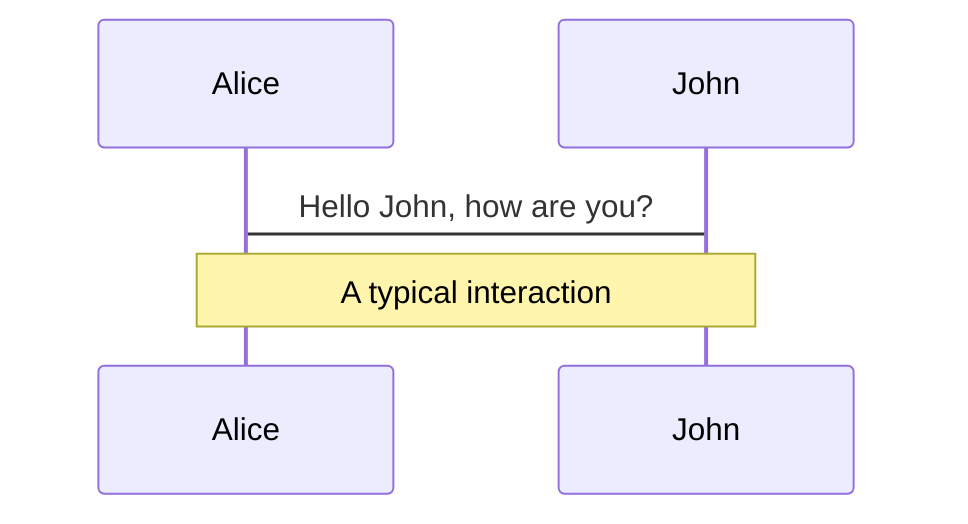
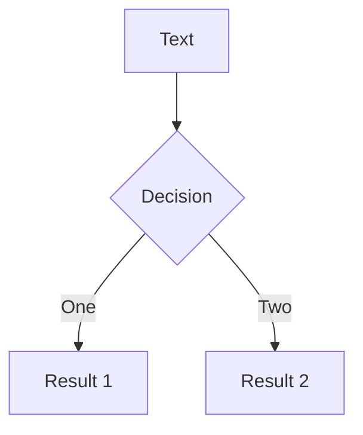
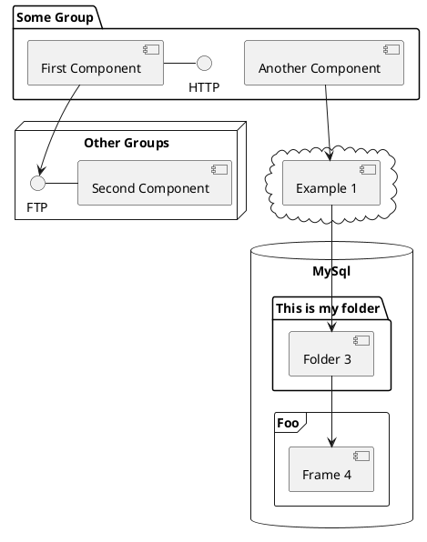

---
# try also 'default' to start simple
theme: apple-basic
# random image from a curated Unsplash collection by Anthony
# like them? see https://unsplash.com/collections/94734566/slidev
background: https://source.unsplash.com/collection/94734566/1920x1080
# apply any windi css classes to the current slide
class: 'text-center'
# https://sli.dev/custom/highlighters.html
highlighter: shiki
# show line numbers in code blocks
lineNumbers: false
# some information about the slides, markdown enabled
info: |
  ## Slidev Starter Template
  Presentation slides for developers.

  Learn more at [Sli.dev](https://sli.dev)
# persist drawings in exports and build
drawings:
  persist: false
---

# 

<div class="pt-12">
  <Logo />

  <div class="text-4xl text-light-blue-400 my-16 rounded cursor-pointer tracking-widest transition-all duration-500" hover="text-blue-500 bg-opacity-10" @click="$slidev.nav.next">
    如何专注于HTML <carbon:arrow-right class="inline"/>
  </div>
</div>

<div class="abs-br m-6 flex gap-2">
  <button @click="$slidev.nav.openInEditor()" title="Open in Editor" class="text-xl icon-btn opacity-50 !border-none !hover:text-white">
    <carbon:edit />
  </button>
  <a href="https://github.com/slidevjs/slidev" target="_blank" alt="GitHub"
    class="text-xl icon-btn opacity-50 !border-none !hover:text-white">
    <carbon-logo-github />
  </a>
</div>

<!--
The last comment block of each slide will be treated as slide notes. It will be visible and editable in Presenter Mode along with the slide. [Read more in the docs](https://sli.dev/guide/syntax.html#notes)
-->

---

# About Me

<div class="w-full relative mt-6">
  <div class="relative w-40 h-40">
    
    
    
  </div>

  <div
    class="text-5xl absolute top-14 left-40 text-[#2B90B6] -z-1"
    v-motion
    :initial="{ x: -160, opacity: 0}"
    :enter="{ x: 0, opacity: 1, transition: { delay: 2000, duration: 1000 } }">
    <div>马金萍</div>
    <br>
    <div class="text-2xl">高级前端开发工程师</div>
    <div class="text-2xl">广联达上海</div>

  </div>
</div>

<script setup lang="ts">
const final = {
  x: 0,
  y: 0,
  rotate: 0,
  scale: 1,
  transition: {
    type: 'spring',
    damping: 10,
    stiffness: 20,
    mass: 2
  }
}
</script>

<div
  v-motion
  :initial="{ x:35, y: 40, opacity: 0}"
  :enter="{ y: 0, opacity: 1, transition: { delay: 3500 } }">

[联系我](https://sli.dev/guide/animations.html#motion)

</div>

---

# Tailwind CSS

<br>

<p class="max-w-screen-lg sm:leading-10 font-medium my-10 sm:mb-11">Tailwind CSS 是一个功能类优先的 CSS 框架, <a href="https://github.com/postcss/postcss">PostCSS</a>  插件，它集成了 <code class="font-mono text-gray-900 font-bold">flex</code>, <code class="font-mono text-gray-900 font-bold ">pt-4</code>, <code class="font-mono text-gray-900 font-bold ">text-center</code> 和 <code class="font-mono text-gray-900 font-bold ">rotate-90</code> 等这样的的类，它们能直接在HTML中组合起来，完成任何设计。</p>

- 📝 **[Utility First](https://tailwindcss.com/docs/utility-first)** - 在原始功能类的基础上构建复杂的页面
- 🎨 **[Responsive Design](https://tailwindcss.com/docs/responsive-design)** - 完全响应式用户界面
- 🧑‍💻 **[Hover, Focus, etc](https://tailwindcss.com/docs/hover-focus-and-other-states)** - 使用悬停、焦点和其它状态来设置元素样式
- 🤹 **[Adding Base Styles](https://tailwindcss.com/docs/adding-base-styles)** - 在 Tailwind 的基础上添加自己的全局基础样式
- 🎥 **[Extracting Components](https://tailwindcss.com/docs/extracting-components)** - 处理复用并且保持功能优先项目的可维护性
- 📤 **[Adding New Utilities](https://tailwindcss.com/docs/adding-new-utilities)** - 使用自定义功能类来扩展
- 🛠 **[Functions, Directives](https://tailwindcss.com/docs/functions-and-directives)** - 暴露CSS的函数和指令的参考说明

<br>
<br>

Read more about [Tailwind CSS](https://tailwindcss.com/)

<!--
You can have `style` tag in markdown to override the style for the current page.
Learn more: https://sli.dev/guide/syntax#embedded-styles
-->

<style>
h1 {
  background-color: #2B90B6;
  background-image: linear-gradient(45deg, #4EC5D4 10%, #146b8c 20%);
  background-size: 100%;
  -webkit-background-clip: text;
  -moz-background-clip: text;
  -webkit-text-fill-color: transparent;
  -moz-text-fill-color: transparent;
}
</style>

---

# 专注于HTML

<br>

<div grid="~ cols-2 gap-4">

<div>
<span class="text-blue-300 py-4">before</span>

### 来回切换写样式😭😭😭

```html
<div class="chat-notification">
  <div class="chat-notification-logo-wrapper">
    
  </div>
  <div class="chat-notification-content">
    <h4 class="chat-notification-title">ChitChat</h4>
    <p class="chat-notification-message">You have a new message!</p>
  </div>
</div>

<style>
  .chat-notification {}
  .chat-notification-logo-wrapper {}
  .chat-notification-logo {}
  .chat-notification-content {}
  .chat-notification-title {}
  .chat-notification-message {}
</style>
```
  </div>

  <div>
    <span class="text-blue-300 py-4">now</span>

### <span class="text-blue-600">专注于HTML🥳🥳🥳</span>

```html
<div class="p-6 max-w-sm mx-auto bg-white rounded-xl shadow-md flex items-center space-x-4">
  <div class="flex-shrink-0">
    
  </div>
  <div>
    <div class="text-xl font-medium text-black">ChitChat</div>
    <p class="text-gray-500">You have a new message!</p>
  </div>
</div>
```
</div>

</div>

---

# Windi CSS

<div class="py-4 text-xl text-light-blue-300">
Windi CSS 是下一代功能类优先的 CSS 框架
</div>

<div v-click>
  通过扫描<code>HTML</code>与<code>CSS</code>并按需生成页面，<code>Windi CSS</code>能够在开发中提供更快的加载时间和快速的<code>HMR</code>，并且不需要在生产中<code>Purge</code>多余的样式。
</div>

<br>

<div grid="~ cols-2 gap-4">

<div v-click>

### [more Feature](https://windicss.org/features/)

```js
const moreFeature = [
    Value Auto-infer,
    Varient Groups,
    Shortcuts,
    Important Prefix,
    Directives,
    Attributify Mode,
    Visual Analyzer
]
```

</div>

<div v-click>

<div 
  v-motion
  :initial="{ x: 100 }"
  :enter="{ x: 0 }"
  class="inline-flex py-4 text-xl">
完全兼容<code>tailwind 2.x</code>
</div>

```js
const windiCSS = [
    ...tailwindCSS,
    ...moreFeature
]
```

</div>

</div>


---

# Compare

<br>

| **_TailwindCSS_** | **_WindiCSS_** |
| --- | --- |
| 公司驱动开发 | 社区驱动开发 |
| 依赖 **PostCSS**, **autoprefixer** | **0** 依赖 |
| 4302 commits, 204 contributors, 364k used | 865 commits, 31 contributors, 3.4k used |
| DX **bad** | DX **better** |
| Reading **bad** | Reading **better** |
| Tailwind JIT 是一个 postcss 插件，它启动文件系统观察器来扫描源代码，以便按需生成 CSS | Windi CSS 是一个独立的编译器，没有依赖项，可以在任何地方工作。 不同的构建工具/框架都有插件，DX很酷。 |

---
layout: image-right
image: https://source.unsplash.com/collection/94734566/1920x1080
---

# Code

Use code snippets and get the highlighting directly![^1]

```ts {all|2|1-6|9|all}
interface User {
  id: number
  firstName: string
  lastName: string
  role: string
}

function updateUser(id: number, update: User) {
  const user = getUser(id)
  const newUser = {...user, ...update}  
  saveUser(id, newUser)
}
```

<arrow v-click="3" x1="400" y1="420" x2="230" y2="330" color="#564" width="3" arrowSize="1" />

[^1]: [Learn More](https://sli.dev/guide/syntax.html#line-highlighting)

<style>
.footnotes-sep {
  @apply mt-20 opacity-10;
}
.footnotes {
  @apply text-sm opacity-75;
}
.footnote-backref {
  display: none;
}
</style>

---

# Components

<div grid="~ cols-2 gap-4">
<div>

You can use Vue components directly inside your slides.

We have provided a few built-in components like `<Tweet/>` and `<Youtube/>` that you can use directly. And adding your custom components is also super easy.

```html
<Counter :count="10" />
```

<!-- ./components/Counter.vue -->
<Counter :count="10" m="t-4" />

Check out [the guides](https://sli.dev/builtin/components.html) for more.

</div>
<div>

```html
<Tweet id="1390115482657726468" />
```

<Tweet id="1390115482657726468" scale="0.65" />

</div>
</div>


---
class: px-20
---

# Themes

Slidev comes with powerful theming support. Themes can provide styles, layouts, components, or even configurations for tools. Switching between themes by just **one edit** in your frontmatter:

<div grid="~ cols-2 gap-2" m="-t-2">

```yaml
---
theme: default
---
```

```yaml
---
theme: seriph
---
```


</div>

Read more about [How to use a theme](https://sli.dev/themes/use.html) and
check out the [Awesome Themes Gallery](https://sli.dev/themes/gallery.html).

---
preload: false
---

# Animations

Animations are powered by [@vueuse/motion](https://motion.vueuse.org/).

```html
<div
  v-motion
  :initial="{ x: -80 }"
  :enter="{ x: 0 }">
  Slidev
</div>
```

<div class="w-60 relative mt-6">
  <div class="relative w-40 h-40">
    
    
    
  </div>

  <div
    class="text-5xl absolute top-14 left-40 text-[#2B90B6] -z-1"
    v-motion
    :initial="{ x: -80, opacity: 0}"
    :enter="{ x: 0, opacity: 1, transition: { delay: 2000, duration: 1000 } }">
    Slidev
  </div>
</div>

<!-- vue script setup scripts can be directly used in markdown, and will only affects current page -->
<script setup lang="ts">
const final = {
  x: 0,
  y: 0,
  rotate: 0,
  scale: 1,
  transition: {
    type: 'spring',
    damping: 10,
    stiffness: 20,
    mass: 2
  }
}
</script>

<div
  v-motion
  :initial="{ x:35, y: 40, opacity: 0}"
  :enter="{ y: 0, opacity: 1, transition: { delay: 3500 } }">

[Learn More](https://sli.dev/guide/animations.html#motion)

</div>

---

# LaTeX

LaTeX is supported out-of-box powered by [KaTeX](https://katex.org/).

<br>

Inline $\sqrt{3x-1}+(1+x)^2$

Block
$$
\begin{array}{c}

\nabla \times \vec{\mathbf{B}} -\, \frac1c\, \frac{\partial\vec{\mathbf{E}}}{\partial t} &
= \frac{4\pi}{c}\vec{\mathbf{j}}    \nabla \cdot \vec{\mathbf{E}} & = 4 \pi \rho \\

\nabla \times \vec{\mathbf{E}}\, +\, \frac1c\, \frac{\partial\vec{\mathbf{B}}}{\partial t} & = \vec{\mathbf{0}} \\

\nabla \cdot \vec{\mathbf{B}} & = 0

\end{array}
$$

<br>

[Learn more](https://sli.dev/guide/syntax#latex)

---

# Diagrams

You can create diagrams / graphs from textual descriptions, directly in your Markdown.

<div class="grid grid-cols-3 gap-10 pt-4 -mb-6">







</div>

[Learn More](https://sli.dev/guide/syntax.html#diagrams)


---
layout: center
class: text-center
---

# Learn More

[Documentations](https://sli.dev) · [GitHub](https://github.com/slidevjs/slidev) · [Showcases](https://sli.dev/showcases.html)
